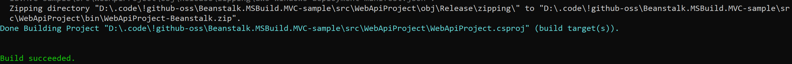
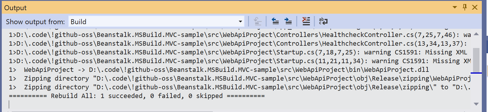

# Beanstalk.MSBuild.MVC-sample
Sample for https://github.com/derwasp/Beanstalk.MSBuild.MVC

This project in its `Release` configuration creates a zip compatible with the cloudformation template that is bundled with the project.
To build the project use either VisualStudio in Release configuration or the following MSBuild command:
`msbuild WebApiProject.csproj /t:build /p:Configuration=Release`

Note that MSBuild `>15.8` is required for `Beanstalk.MSBuild.MVC` to work properly.

This is what the end of the MSBuild output should look like:



And this is the same for VisualStudio:



# Deploy

To deploy this project to AWS via beanstalk & cloudformation you should use the following:

1) Go to the `./artifacts` folder and open a command line with aws cli
2) Run the `package` command, e.g.:
```
aws cloudformation package --template-file cloudformation.yml --s3-bucket my-bucket --s3-prefix my-prefix --output-template-file cloudformation-transformed.yml
```
This should upload the artifact to s3 and create a transformed cloudformation template that you can deploy.
3) Run the `deploy` command:
```
aws cloudformation deploy --template-file cloudformation-transformed.yml --stack-name my-beanstalk-stack-name --capabilities CAPABILITY_NAMED_IAM
```
This will deploy the template that we just created.